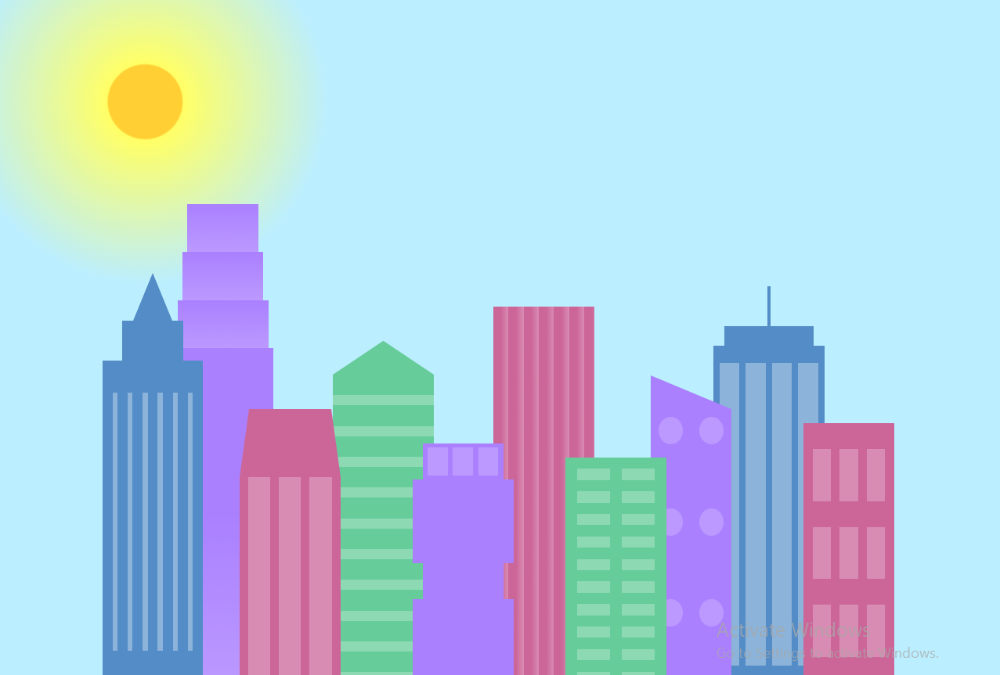
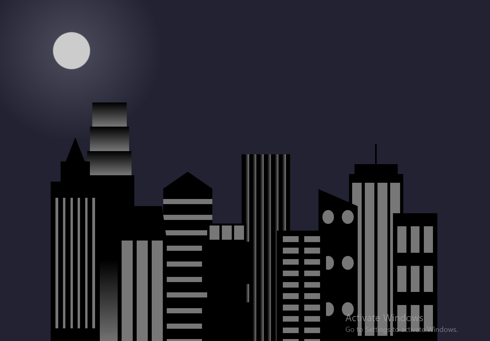

# City Skyline Project

This project creates a visually appealing city skyline using HTML and CSS. The skyline includes both background and foreground buildings, each with unique designs and colors. Additionally, there's a gradient-based sky with a sun-like appearance.

## Table of Contents

- [Features](#features)
- [Adding a Screenshot](#adding-a-screenshot)

## Features

- Responsive design with media queries for different viewport sizes.
- Customizable building and window colors using CSS custom properties.
- Detailed building elements and window designs.
- A dynamic radial gradient for the sky, creating a sun-like effect.

## Adding a screenshot

