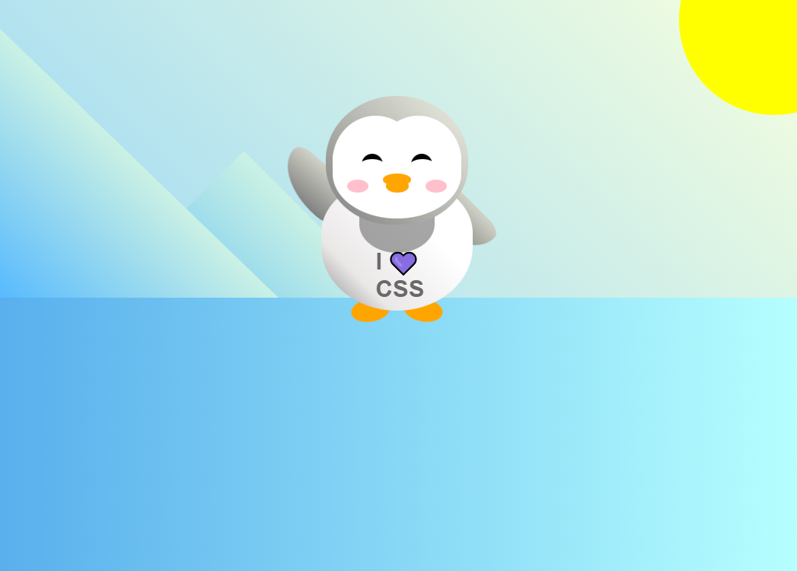

# Penguin CSS Project

This project is a fun and creative use of HTML and CSS to create a cute penguin character and its surroundings. It includes various CSS animations and styles to bring the penguin to life on your web page.

## Features

- Animated waving of the penguin's left arm.
- Click the penguin to make it grow larger (`:active` state).
- Detailed styling of the penguin's facial features, beak, and blush.
- Stylish representation of the penguin's shirt, body, and feet.
- Scenic background with mountains, sun, and ground.
